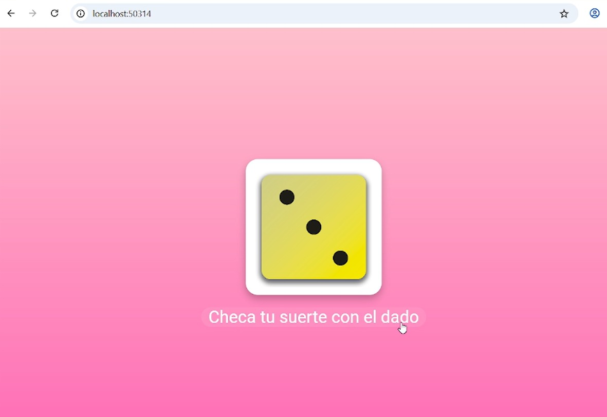

# 🎲 Dice Roller App

Una app simple hecha con Flutter que simula el lanzamiento de un dado con una animación y botón interactivo.  
Presiona el botón "Roll Dice" para cambiar aleatoriamente el valor del dado.

---

## ✨ Cambios realizados

- 🎨 **Fondo de pantalla**: se cambió de un degradado azul a un degradado **rosa**.
- 🎲 **Estilo del dado**: ahora el dado tiene un fondo blanco, bordes redondeados y sombra para mejor visibilidad.
- 🖌️ **Tipografía y botones**: se mejoró el tamaño del texto y el estilo del botón.

---

## 📸 Antes y Después

### 🧾 Antes


### 🎉 Después


---

## 🚀 Cómo ejecutar

```bash
flutter pub get
flutter run

